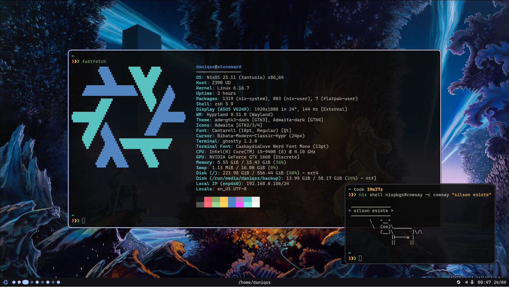

<header align="center">
  <h1>
    daniqss/nixcfg
  </h1>

  
  
  
</header>

# how to install
this is basically a little guide to remember the next time I add a host or reinstall nixos in a machine
1. install nixos (non-desktop option) with the graphical installer
2. boot to the new system
3. run `nix shell nixpkgs#git --extra-experimental-features nix-command --extra-experimental-features flakes`
4. clone the repo and,
  - if ur adding a new host
    1. set up wifi with `nmtui` if ur on a laptop
    2. add the new host in `~/nixcfg/hosts/default.nix`
    3. create a new folder called after the new host's name in `~/nixcfg/hosts` with the required files and options
5. run `sudo nixos-rebuild boot --flake ~/nixcfg/#<HOSTNAME>` and `reboot`
6. enjoy

# content
This configuration fits my needs and I intend to update it as I need it. My objective with this config is to store in this repo all my hosts configurations plus some packages that are not in nixpkgs and templates for all my programming use cases

## hosts
hosts are named thematically after the stormlight archive radiant orders according to their use

| Host           | Description                                         | Arch          |
|----------------|-----------------------------------------------------|---------------|
| **stoneward**  | Intel + NVIDIA desktop, for programming and gaming  | x86_64-linux  |
| **windrunner** | AMD uni laptop                                      | x86_64-linux  |

## rice
I'm currently using the [hyprland](https://hypr.land) wayland compositor using my own bar made with [quickshell](https://quickshell.org/) that I want to upgrade until it satisfies all my desktop shell necesities.
I use [matugen](https://github.com/InioX/matugen) to generate from the current selected wallpaper the colors schemes used in most of the software I use (not the terminal nor vscode)

# special thanks to
Thanks to these people from whom I learned ~~and sometimes stole~~ nix and quickshell, and I got inspiration for desktop shell designs

- [raexera](https://github.com/raexera/yuki),
- [fufexan](https://github.com/fufexan/dotfiles),
- [redyf](https://github.com/redyf/nixdots),
- [NotAShelf](https://github.com/NotAShelf/nyx),
- [outfoxxed](https://git.outfoxxed.me/outfoxxed/nixnew),
- [isabelroses](https://github.com/isabelroses/dotfiles)
